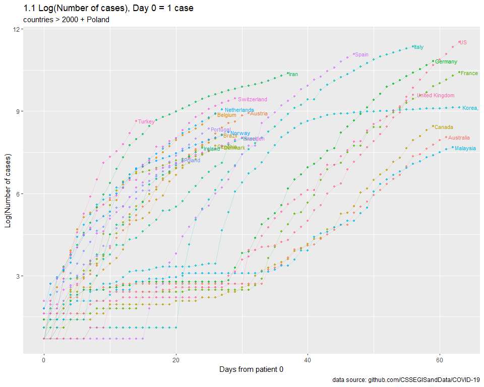

COVID-19
================
MK
16 03 2020

## Params

``` r
url_conf <- "https://raw.githubusercontent.com/CSSEGISandData/COVID-19/master/csse_covid_19_data/csse_covid_19_time_series/time_series_19-covid-Confirmed.csv"
START_CASES_NO <- 1
MIN_CASES      <- 1000
MAX_CASES      <- Inf
```

## Calc

``` r
data_conf <- 
  fread(url_conf) %>% 
  melt(., id.vars = c(1,2,3,4)) %>% 
  mutate (date = as.Date(variable, format = "%m/%d/%y")) %>% 
  select(-variable) %>% 
  rename(country = `Country/Region`, province = `Province/State`) %>% 
  group_by(country, date) %>% 
  summarize(value = sum(value))

conf_first <- 
  data_conf %>% 
  filter(value > START_CASES_NO) %>% 
  group_by(country) %>% 
  mutate(maxv = max(value)) %>% 
  top_n(-1, wt = date) %>% 
  select(-value) %>% 
  rename(date_first = date)

conf <- 
  data_conf %>% 
  left_join(., conf_first) %>% 
  mutate(days = date-date_first) %>% 
  filter(days >=0) %>% 
  select(-date, -date_first)
```

    ## Joining, by = "country"

``` r
conf_filtered <- 
  conf %>% 
  filter((maxv > MIN_CASES & maxv < MAX_CASES & country != "China") | country == "Poland") %>% 
  mutate(maxv = ifelse(value == maxv, 1, 0))
```

### Plots

<!-- -->
