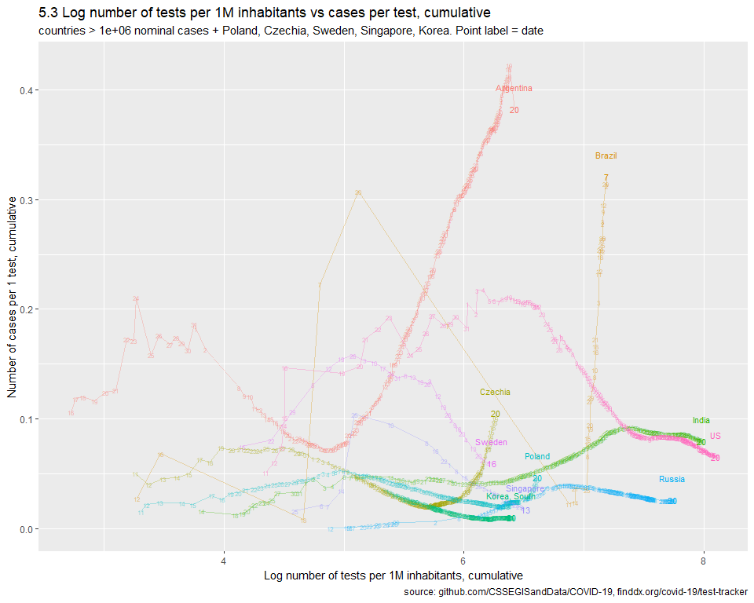

SARS-nCOV-19
================
MK
16 03 2020

## Params

``` r
url_conf <- "https://raw.githubusercontent.com/CSSEGISandData/COVID-19/master/csse_covid_19_data/csse_covid_19_time_series/time_series_covid19_confirmed_global.csv"
url_dead <- "https://raw.githubusercontent.com/CSSEGISandData/COVID-19/master/csse_covid_19_data/csse_covid_19_time_series/time_series_covid19_deaths_global.csv"
MIN_VALUE <- 5000
MIN_VALUE_DEATHS <- 500
MIN_DATE_TESTS <- "2020-03-10"
MIN_DATE <- "2020-03-20"
TODAY    <- "2020-03-28"
TAKE_LOG <- TRUE
```

## Calc

``` r
build_data <- function(START_CASES_NO = 1, MIN_CASES = MIN_VALUE, MAX_CASES = Inf, CHART_MAX = 10000, countries_include = c("Poland"), dead=FALSE){

  population <- fread("API_SP.POP.TOTL_DS2_en_csv_v2_866861.csv", header = TRUE) %>% 
    select(`Country Name`, `2018`) %>% 
    rename(country = `Country Name`, pop = `2018`) %>%
    mutate(pop = pop/1000000)

  land  <- fread("API_AG.LND.TOTL.K2_DS2_en_csv_v2_888929.csv", header = TRUE) %>% 
    select(`Country Name`, `2018`) %>% 
    rename(country = `Country Name`, land = `2018`)
  
  data_conf <- 
    fread(ifelse(dead,url_dead,url_conf)) %>% 
    melt(., id.vars = c(1,2,3,4)) %>% 
    mutate (date = as.Date(variable, format = "%m/%d/%y")) %>% 
    select(-variable) %>% 
    rename(country = `Country/Region`, province = `Province/State`) %>% 
    group_by(country, date) %>% 
    summarize(value = sum(value)) %>%
    mutate(value_new = value - lag(value))
  
  conf_first <- 
    data_conf %>% 
    filter(value > START_CASES_NO) %>% 
    group_by(country) %>% 
    mutate(maxv = max(value)) %>% 
    top_n(-1, wt = date) %>% 
    select(-value, -value_new) %>% 
    rename(date_first = date)
  
  tests <- fread("Tests.csv", header = TRUE) %>%
    mutate(date = as.Date(date)) %>%
    mutate(
      country = if_else(country == "Czech Republic", "Czechia",country),
      country = if_else(country == "Iran (Islamic Republic of)", "Iran",country),
      country = if_else(country == "Republic of Korea", "Korea, South",country),
      country = if_else(country == "USA", "US",country),
      country = if_else(country == "Mainland China", "China",country)
    ) %>%
    select(country,date,new_tests,tests_cumulative) %>%
    group_by(country) %>%
    mutate(test_latest = ifelse(date == max(date), 1, 0)) %>%
    ungroup(.) %>%
    rename(tests = tests_cumulative) %>%
    rename(tests_new = new_tests)
  
  conf <- 
    data_conf %>% 
    left_join(., conf_first) %>% 
    mutate(days = date-date_first) %>% 
    filter(days >=0) %>% 
    left_join(., population) %>% 
    mutate(value_per_1M = value/pop) %>%
    left_join(., tests) %>%
    mutate(tests_per_1M = tests/pop) %>%
    mutate(cases_per_test = value/tests) %>%
    mutate(tests_per_1M_new = tests_new/pop) %>%
    mutate(cases_per_test_new = value_new/tests_new) %>%    
    left_join(., land) %>%
    mutate(pop_density = pop/land) %>%
    select(-date_first, -pop)

  conf_filtered <- 
    conf %>% 
    filter((maxv > MIN_CASES & maxv < MAX_CASES & country != "China") | country %in% countries_include) %>%
    filter(value < CHART_MAX) %>%
    mutate(maxv = ifelse(value == maxv, 1, 0))
  
  return(conf_filtered)
}
```

### Plots

<!-- -->

<!-- -->

<!-- -->

<!-- -->

<!-- -->

<!-- -->

<!-- -->

Hipoteza: im większa gęstość zaludnienia, tym szybciej powinien krążyć
wirus.

### Rates:

Idea:
<https://ourworldindata.org/grapher/tests-vs-confirmed-cases-covid-19-per-million>

<!-- -->

<!-- -->

### Forecast

    ## Joining, by = "country"
    ## Joining, by = "country"

<!-- -->

### Deaths

<!-- -->

<!-- -->
