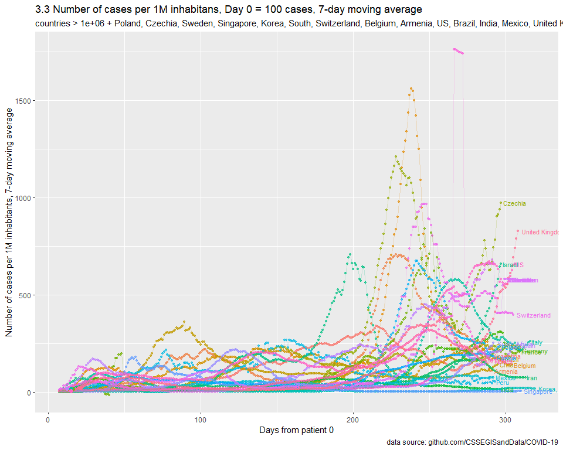
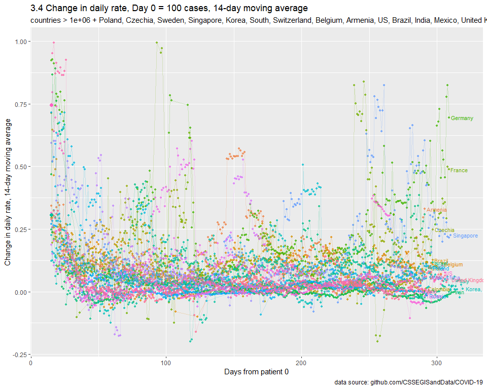
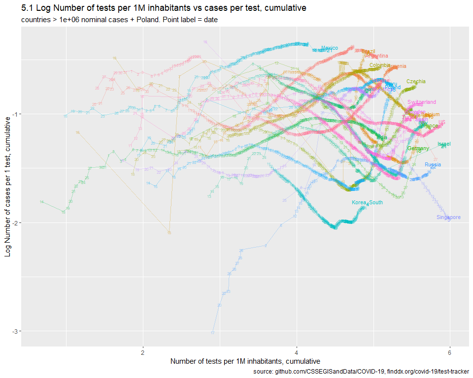
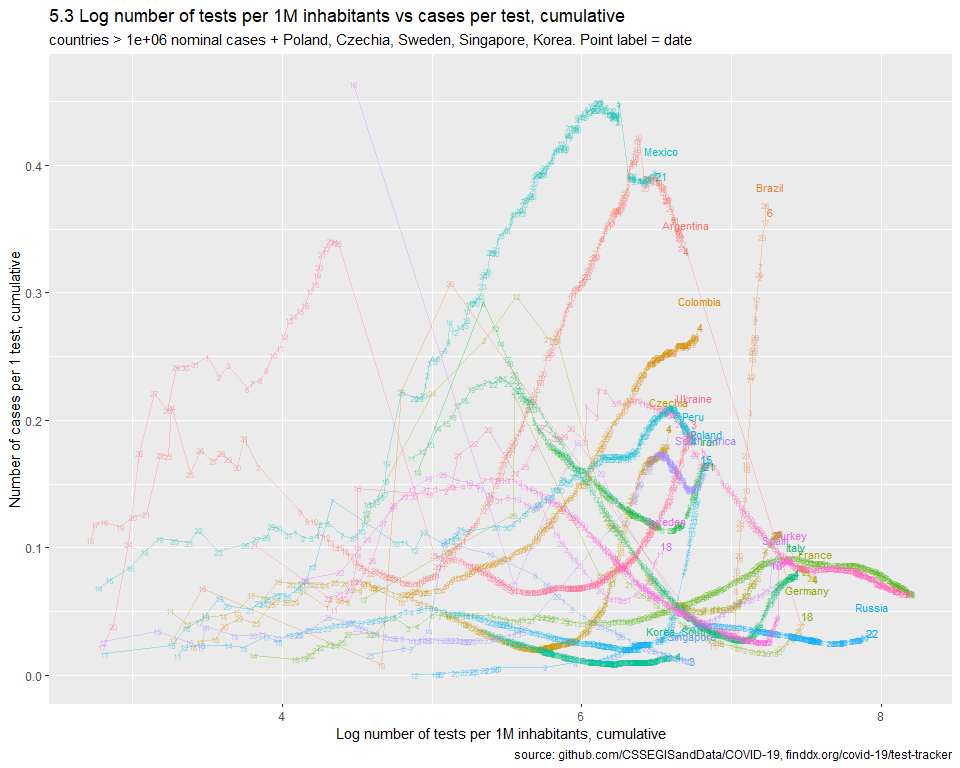
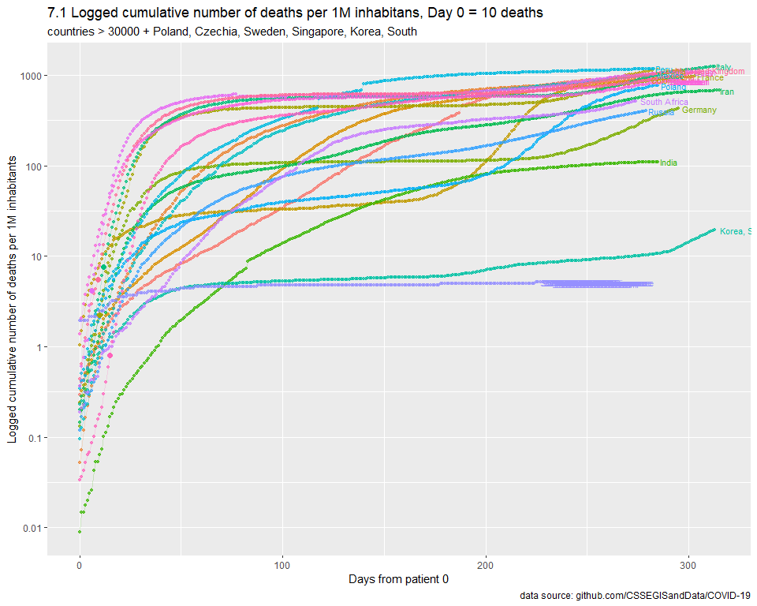
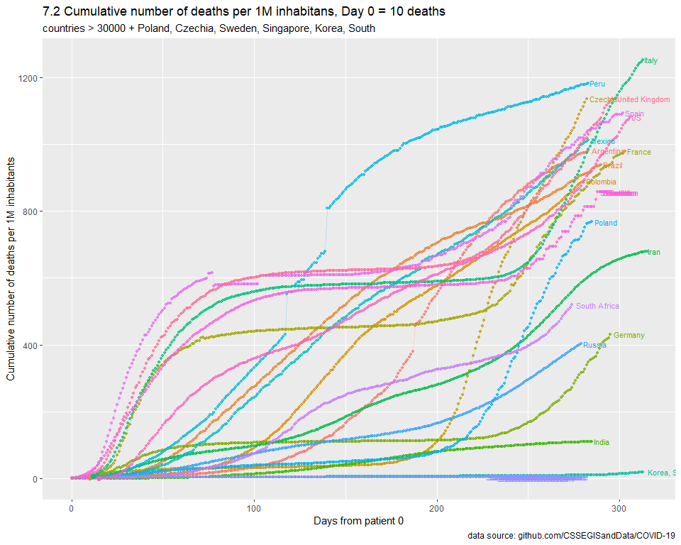

SARS-nCOV-19
================
MK
16 03 2020

## Params

## Calc

## Plots

### 1\. log10(number of cases)

Removed.

### 2\. Nominal number of cases

Removed.

### 3\. Nominal number of cases per 1M inhabitants

<!-- -->

<!-- -->

<!-- -->

### 4\. Other hypothesis

Usunietę.

Hipoteza: im większa gęstość zaludnienia, tym szybciej powinien krążyć
wirus.

### 5\. Tests

Idea:
<https://ourworldindata.org/grapher/tests-vs-confirmed-cases-covid-19-per-million>

<!-- -->

### 6\. Forecast

Removed.

### 7\. Deaths (cumulative)

<!-- -->

<!-- -->

### 8\. Deaths

<!-- -->

<!-- -->

<!-- -->
