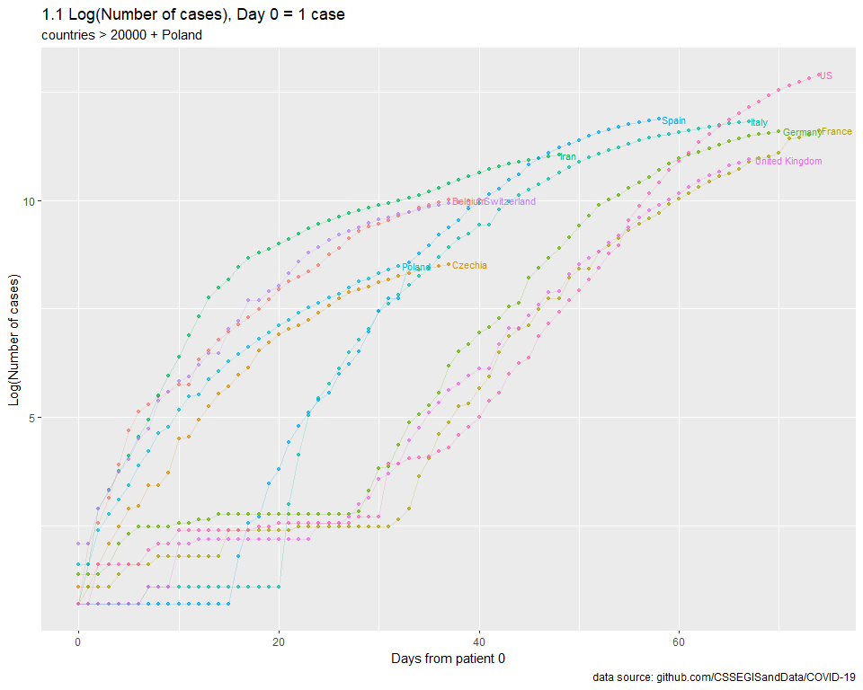

COVID-19
================
MK
16 03 2020

## Params

``` r
url_conf <- "https://raw.githubusercontent.com/CSSEGISandData/COVID-19/master/csse_covid_19_data/csse_covid_19_time_series/time_series_19-covid-Confirmed.csv"
```

## Calc

``` r
build_data <- function(START_CASES_NO = 1, MIN_CASES = 1000, MAX_CASES = Inf, CHART_MAX = 10000, countries_include = c("Poland")){

  data_conf <- 
    fread(url_conf) %>% 
    melt(., id.vars = c(1,2,3,4)) %>% 
    mutate (date = as.Date(variable, format = "%m/%d/%y")) %>% 
    select(-variable) %>% 
    rename(country = `Country/Region`, province = `Province/State`) %>% 
    group_by(country, date) %>% 
    summarize(value = sum(value))
  
  conf_first <- 
    data_conf %>% 
    filter(value > START_CASES_NO) %>% 
    group_by(country) %>% 
    mutate(maxv = max(value)) %>% 
    top_n(-1, wt = date) %>% 
    select(-value) %>% 
    rename(date_first = date)
  
  conf <- 
    data_conf %>% 
    left_join(., conf_first) %>% 
    mutate(days = date-date_first) %>% 
    filter(days >=0) %>% 
    select(-date, -date_first)
  
  conf_filtered <- 
    conf %>% 
    filter((maxv > MIN_CASES & maxv < MAX_CASES & country != "China") | country %in% countries_include) %>%
    filter(value < CHART_MAX) %>%
    mutate(maxv = ifelse(value == maxv, 1, 0))
  
  return(conf_filtered)
}
```

### Plots

<!-- -->

<!-- -->

<!-- -->

#### 2.2. Day 0 = 30 cases, countries \> 1000 + Poland, crop at 10000

<!-- -->
