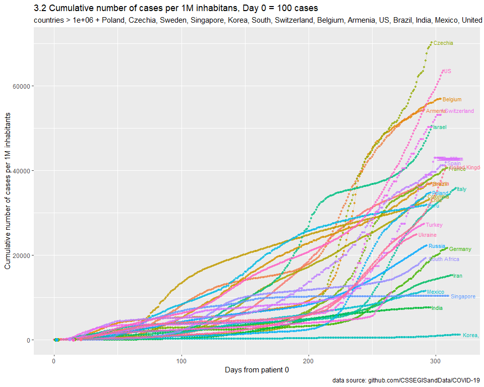
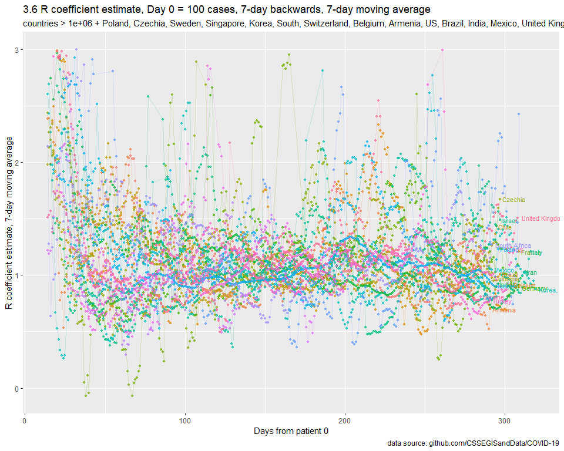
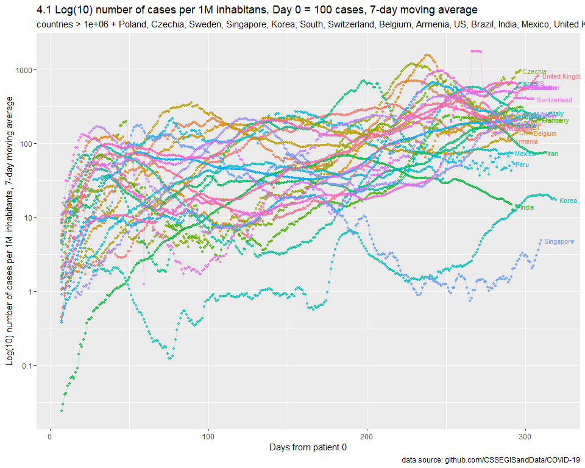

SARS-nCOV-19
================
MK
16 03 2020

## Params

``` r
url_conf <- "https://raw.githubusercontent.com/CSSEGISandData/COVID-19/master/csse_covid_19_data/csse_covid_19_time_series/time_series_19-covid-Confirmed.csv"
MIN_DATE <- "2020-03-10"
TODAY    <- "2020-03-21"
TAKE_LOG <- TRUE
```

## Calc

``` r
build_data <- function(START_CASES_NO = 1, MIN_CASES = 1000, MAX_CASES = Inf, CHART_MAX = 10000, countries_include = c("Poland")){

  population <- fread("API_SP.POP.TOTL_DS2_en_csv_v2_866861.csv", header = TRUE) %>% 
    select(`Country Name`, `2018`) %>% 
    rename(country = `Country Name`, pop = `2018`) %>%
    mutate(pop = pop/1000000)
  
  data_conf <- 
    fread(url_conf) %>% 
    melt(., id.vars = c(1,2,3,4)) %>% 
    mutate (date = as.Date(variable, format = "%m/%d/%y")) %>% 
    select(-variable) %>% 
    rename(country = `Country/Region`, province = `Province/State`) %>% 
    group_by(country, date) %>% 
    summarize(value = sum(value))
  
  conf_first <- 
    data_conf %>% 
    filter(value > START_CASES_NO) %>% 
    group_by(country) %>% 
    mutate(maxv = max(value)) %>% 
    top_n(-1, wt = date) %>% 
    select(-value) %>% 
    rename(date_first = date)
  
  tests <- fread("tests.csv", header = TRUE) %>%
    mutate(date = as.Date(date, format = "%d.%m.%y")) %>%
    group_by(country) %>%
    mutate(test_latest = ifelse(date == max(date), 1, 0)) %>%
    ungroup(.)
  
  conf <- 
    data_conf %>% 
    left_join(., conf_first) %>% 
    mutate(days = date-date_first) %>% 
    filter(days >=0) %>% 
    left_join(., population) %>% 
    mutate(value_per_1M = value/pop) %>%
    left_join(., tests) %>%
    mutate(tests_per_1M = tests/pop) %>%
    mutate(cases_per_test = value/tests) %>%
    select(-date_first, -pop)

  conf_filtered <- 
    conf %>% 
    filter((maxv > MIN_CASES & maxv < MAX_CASES & country != "China") | country %in% countries_include) %>%
    filter(value < CHART_MAX) %>%
    mutate(maxv = ifelse(value == maxv, 1, 0))
  
  return(conf_filtered)
}
```

### Plots

<!-- -->

<!-- -->

<!-- -->

<!-- -->

<!-- -->

<!-- -->

### Rates:

Idea:
<https://ourworldindata.org/grapher/tests-vs-confirmed-cases-covid-19-per-million>

<!-- -->

### Forecast

    ## Joining, by = "country"
    ## Joining, by = "country"

<!-- -->
