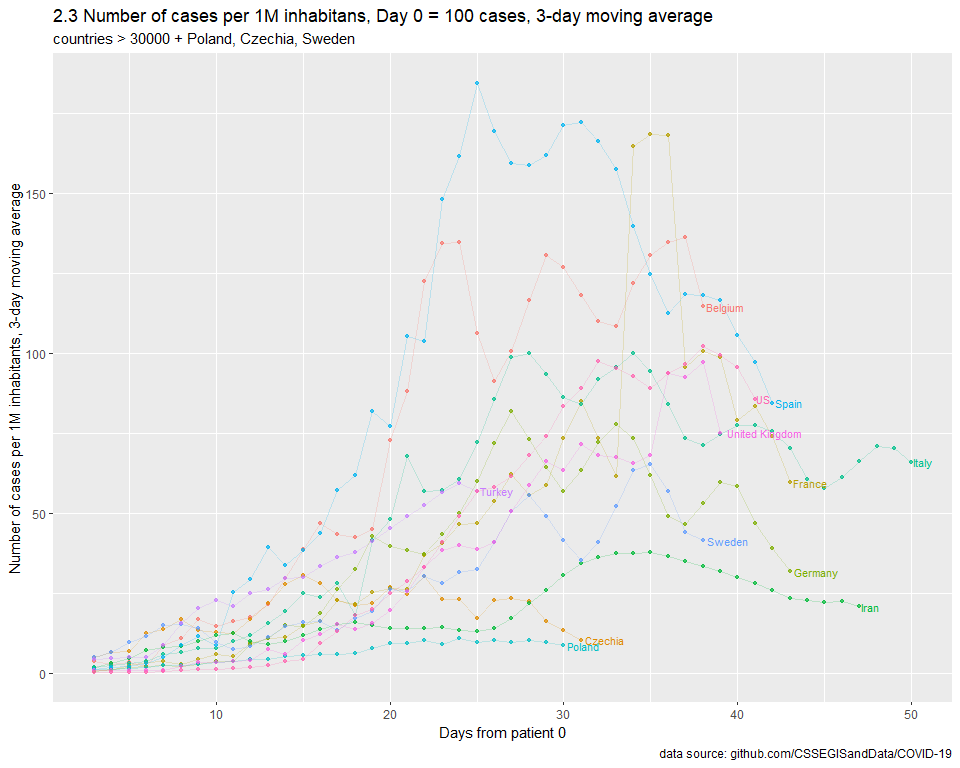

SARS-nCOV-19
================
MK
16 03 2020

## Params

``` r
url_conf <- "https://raw.githubusercontent.com/CSSEGISandData/COVID-19/master/csse_covid_19_data/csse_covid_19_time_series/time_series_covid19_confirmed_global.csv"
url_dead <- "https://raw.githubusercontent.com/CSSEGISandData/COVID-19/master/csse_covid_19_data/csse_covid_19_time_series/time_series_covid19_deaths_global.csv"
lookup <- "https://raw.githubusercontent.com/CSSEGISandData/COVID-19/master/csse_covid_19_data/UID_ISO_FIPS_LookUp_Table.csv"
MIN_CASES_CUM     <- 20000
MIN_DEATHS_CUM    <- 1000
MIN_DATE_TESTS <- "2020-03-10"
MIN_DATE       <- "2020-03-25"
TODAY          <- "2020-04-08"
TAKE_LOG <- TRUE
START_CASES_NO = 1
START_DEATHS_NO = 10
CHART_MAX = 10000
countries_include = c("Poland", "Czechia", "Sweden")
dead = FALSE
MA = 1
pc = TRUE
cumulative = TRUE

labs_x = "Days from patient 0"
subtitle = NA
caption = "data source: github.com/CSSEGISandData/COVID-19"
legend_off = TRUE
```

## Calc

``` r
build_data <- function(START_CASES_NO = 1, dead=FALSE, MA = 1, cumulative = TRUE, pc = TRUE, START_DEATHS_NO = 1){

  population <- fread("API_SP.POP.TOTL_DS2_en_csv_v2_866861.csv", header = TRUE) %>% 
    select(`Country Name`, `2018`) %>% 
    rename(country = `Country Name`, pop = `2018`) %>%
    mutate(pop = pop/1000000)

  land  <- fread("API_AG.LND.TOTL.K2_DS2_en_csv_v2_888929.csv", header = TRUE) %>% 
    select(`Country Name`, `2018`) %>% 
    rename(country = `Country Name`, land = `2018`)
  
  tests <- fread("Tests.csv", header = TRUE) %>%
    mutate(date = as.Date(date)) %>%
    mutate(
      country = ifelse(country == "Czech Republic", "Czechia",country),
      country = ifelse(country == "Iran (Islamic Republic of)", "Iran",country),
      country = ifelse(country == "Republic of Korea", "Korea, South",country),
      country = ifelse(country == "USA", "US",country),
      country = ifelse(country == "Mainland China", "China",country)
    ) %>%
    select(country,date,new_tests,tests_cumulative) %>%
    group_by(country) %>%
    filter(new_tests > 0) %>%
    mutate(test_latest = ifelse(date == max(date), 1, 0)) %>%
    ungroup(.) %>%
    rename(tests = tests_cumulative) %>%
    rename(tests_new = new_tests) %>%
    mutate(
      tests = case_when(cumulative == TRUE ~ tests, TRUE ~ tests_new),
      tests = case_when(MA > 1 ~ rollapply(tests,MA,mean,align='right',fill=NA_real_), TRUE ~ 1.0*tests)
    )
  
  data <- 
    fread(ifelse(dead,url_dead,url_conf)) %>%
    melt(., id.vars = c(1,2,3,4)) %>% 
    mutate (date = as.Date(variable, format = "%m/%d/%y")) %>% 
    select(-variable) %>% 
    rename(country = `Country/Region`, province = `Province/State`) %>% 
    group_by(country, date) %>% 
    summarize(value = sum(value))
  
  data_first <- 
    data %>% 
    filter((dead == FALSE & value > START_CASES_NO) | (dead == TRUE & value > START_DEATHS_NO)) %>% 
    group_by(country) %>% 
    mutate(maxv = max(value)) %>% 
    top_n(-1, wt = date) %>% 
    select(country, date, maxv) %>% 
    rename(date_first = date)
  
  data_conf <- 
    data %>% 
    left_join(., data_first, by = "country") %>% 
    mutate(is_maxv = ifelse(value == maxv, 1, 0)) %>%
    mutate(days = date-date_first) %>% 
    filter(days >=0) %>% 
    mutate(
      value = case_when(cumulative == TRUE ~ value, TRUE ~ value -dplyr::lag(value)),
    ) %>%  
    left_join(., tests) %>%
    mutate(
      cases_per_test = case_when(MA > 1 ~ rollapply(value/tests,MA,mean,align='right',fill=NA_real_), TRUE ~ 1.0*value/tests)
    ) %>% 
    
    left_join(., population) %>% 
    mutate(
       value = case_when(MA > 1 ~ rollapply(value      ,MA,mean,align='right',fill=NA_real_), TRUE ~ 1.0*value),
       value = case_when(pc == TRUE ~ value/pop, TRUE ~ 1.0*value),
       tests = case_when(pc == TRUE ~ tests/pop, TRUE ~ 1.0*tests)
    ) %>%
    
    left_join(., land) %>%
    mutate(pop_density = pop/land) %>%
    select(-date_first, -pop)

  MIN_VALUE <- if_else(dead == FALSE, MIN_CASES_CUM, MIN_DEATHS_CUM)

  conf_filtered <- 
    data_conf %>% 
    filter(
      (
        maxv > MIN_VALUE 
        & country != "China" 
      ) 
      | country %in% countries_include
      ) %>%
    filter(value < CHART_MAX)
  
  return(conf_filtered)
}


plot_chart <- function(
  data,
  TAKE_LOG,
  dead = FALSE,
  labs_y, 
  labs_x = "Days from patient 0",
  title, 
  subtitle = NA,
  caption = "data source: github.com/CSSEGISandData/COVID-19", 
  legend_off = TRUE
 ){
  
  data <- data %>%
    mutate(
      value = if(TAKE_LOG) log(value)   else value
    )
  
  if(is.na(subtitle)){
    subtitle <- paste0("countries > ", ifelse(dead, MIN_DEATHS_CUM, MIN_CASES_CUM)," + ",paste(countries_include,collapse=", "))
  }
  
  
  g <- 
    ggplot(data, aes(days, value, colour = country)) + 
    geom_point(alpha = 0.7, size = 1) + 
    geom_line(alpha = 0.2) +
    geom_text(data = data %>% filter(is_maxv == 1), aes(label = country, colour = country, x = days, y = value), hjust = -.1, size = 3) +
    labs(y=labs_y, x = labs_x) +
    labs(title = title, subtitle = subtitle) +
    labs(caption = caption) +
    if(legend_off) theme(legend.position="none")
  
  return(g)
}
```

## Plots

### 1\. Log(number of cases)

Removed.

### 2\. Nominal number of cases

Removed.

### 3\. Nominal number of cases per 1M inhabitants

<!-- -->

<!-- -->

### 4\. Other hypothesis

Usunietę.

Hipoteza: im większa gęstość zaludnienia, tym szybciej powinien krążyć
wirus.

### 5\. Tests

Idea:
<https://ourworldindata.org/grapher/tests-vs-confirmed-cases-covid-19-per-million>

<!-- -->

<!-- -->

### 6\. Forecast

Removed.

### 7\. Deaths (cumulative)

<!-- -->

<!-- -->

### 8\. Deaths

<!-- -->

<!-- -->
